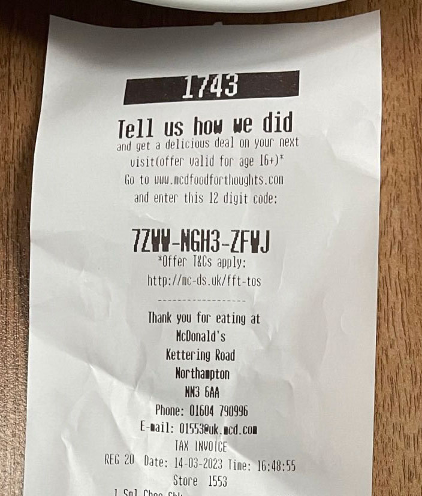

# McDonald's UK Survey Code Generator

Given a store ID, order number, and date/time of purchase, this script will generate a code that can be entered in the [Food for Thoughts](https://www.mcdfoodforthoughts.com/) survey that, upon completion, gives you another code that can be redeemed for discounted items.

As of August 2023 you only need to enter the code to begin the survey; a price is not required.

## Usage

Call the script with 3 arguments:

```
get_code.py 1553 1743 "2023-03-14 16:48"
```

The above will output `7ZWW-NGH3-ZFWJ` which matches the following receipt:



A non-exhaustive list of store IDs is included (stores.tsv). You can also find store IDs by inspecting the return data from the [McDonald's store locator](https://www.mcdonalds.com/gb/en-gb/restaurant-locator.html) or by simply checking receipts from stores.

## About

The survey code above can be broken down as follows:

| Code    | Decimal   | Meaning                                                                            |
| -       | -         | -                                                                                  |
| `7ZW`   | 1553      | Store ID.                                                                          |
| `W`     | 3         | Not sure, but the vast majority of receipts always seem to have `W` here.          |
| `NG`    | 168       | Order ID: last two digits + 125 (usually).                                         |
| `H3ZFW` | 3,742,128 | Date/time of purchase (represented as number of minutes since `2016-02-01 00:00`). |
| `J`     | 23        | Check digit (Luhn mod _N_ algorithm; uses 25 as a base).                           |

Values are encoded using the following base 25 system:

<table>
    <tbody>
        <tr>
            <th>Decimal</th>
            <td>0</td>
            <td>1</td>
            <td>2</td>
            <td>3</td>
            <td>4</td>
            <td>5</td>
            <td>6</td>
            <td>7</td>
            <td>8</td>
            <td>9</td>
            <td>10</td>
            <td>11</td>
            <td>12</td>
            <td>13</td>
            <td>14</td>
            <td>15</td>
            <td>16</td>
            <td>17</td>
            <td>18</td>
            <td>19</td>
            <td>20</td>
            <td>21</td>
            <td>22</td>
            <td>23</td>
            <td>24</td>
        </tr>
        <tr>
            <th>Base 25</th>
            <td>C</td>
            <td>M</td>
            <td>7</td>
            <td>W</td>
            <td>D</td>
            <td>6</td>
            <td>N</td>
            <td>4</td>
            <td>R</td>
            <td>H</td>
            <td>F</td>
            <td>9</td>
            <td>Z</td>
            <td>L</td>
            <td>3</td>
            <td>X</td>
            <td>K</td>
            <td>Q</td>
            <td>G</td>
            <td>V</td>
            <td>P</td>
            <td>B</td>
            <td>T</td>
            <td>J</td>
            <td>Y</td>
        </tr>
    </tbody>
</table>

Further discussion on Reverse Engineering Stack Exchange where this was originally posted: https://reverseengineering.stackexchange.com/questions/32129/mcdonalds-receipt-codes

## Confused?

If the above made no sense to you and/or you just want to generate a code, download this repository using the green "<> Code" button at the top of the page, open demo/page.html in a web browser on your computer/laptop, then fill out the parameters as required.
