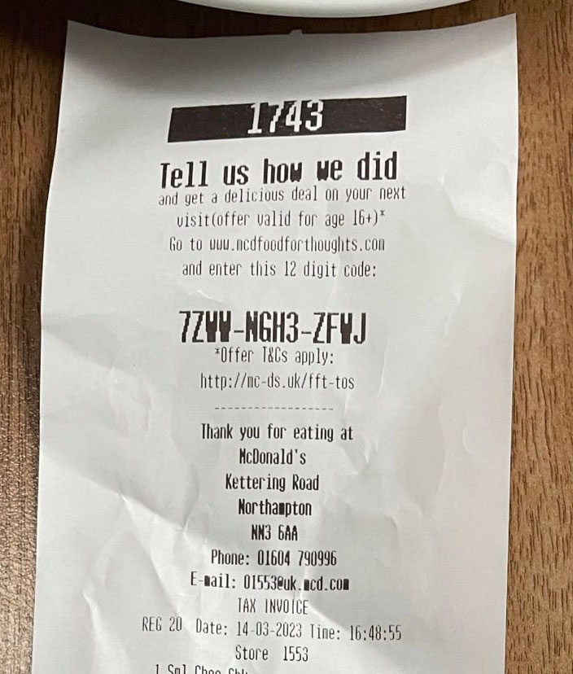

# McDonald's receipt code analysis (unofficial)

An attempt to reverse engineer the 12 digit codes found on McDonald's receipts used for the [Food for Thoughts](https://www.mcdfoodforthoughts.com/) survey.

> [!IMPORTANT]
> **Disclaimer**

This project is an independent, educational analysis of McDonald's UK receipts.

It is **not** affiliated with, endorsed by, or connected to McDonald's International Property Company, Ltd.

The contents of this repository represent speculative research based on publicly available information, and are provided here for research and educational purposes only.

No part of this project is intended to enable or encourage misuse, fraud, or unauthorised access to McDonald's systems.

_Polite notice to McLawyers:_ the french fries emoji, 🍟, is not McDonald's intellectual property; it's a Unicode character.

## How to use

Call the script with the following arguments:

```shell
python get_code.py --store-id 1553 --order-id 1743 --purchased "2023-03-14 16:48"
```

The above will reproduce a known historical code, `7ZWW-NGH3-ZFWJ`, as shown in the following receipt:



Note the receipt contains `REG 20` - this is the default value used in the script, but not all receipts have the same value.

## Algorithm speculation

The survey code above appears to be broken down as follows:

| Code    | Decimal   | Meaning                                                                                                                                  |
| -       | -         | -                                                                                                                                        |
| `7ZW`   | 1553      | Store ID.                                                                                                                                |
| `WNG`   | 2043      | Usually seems to be a combination of the "reg" number multiplied by 100 + the order ID's last two digits. In this case: (20 * 100) + 43. |
| `H3ZFW` | 3,742,128 | Date/time of purchase (represented as number of minutes since `2016-02-01 00:00`).                                                       |
| `J`     | 23        | Check digit (Luhn mod _N_ algorithm; uses 25 as a base).                                                                                 |

Values are encoded using the following base 25 system:

<table>
    <tbody>
        <tr>
            <th>Decimal</th>
            <td>0</td>
            <td>1</td>
            <td>2</td>
            <td>3</td>
            <td>4</td>
            <td>5</td>
            <td>6</td>
            <td>7</td>
            <td>8</td>
            <td>9</td>
            <td>10</td>
            <td>11</td>
            <td>12</td>
            <td>13</td>
            <td>14</td>
            <td>15</td>
            <td>16</td>
            <td>17</td>
            <td>18</td>
            <td>19</td>
            <td>20</td>
            <td>21</td>
            <td>22</td>
            <td>23</td>
            <td>24</td>
        </tr>
        <tr>
            <th>Base 25</th>
            <td>C</td>
            <td>M</td>
            <td>7</td>
            <td>W</td>
            <td>D</td>
            <td>6</td>
            <td>N</td>
            <td>4</td>
            <td>R</td>
            <td>H</td>
            <td>F</td>
            <td>9</td>
            <td>Z</td>
            <td>L</td>
            <td>3</td>
            <td>X</td>
            <td>K</td>
            <td>Q</td>
            <td>G</td>
            <td>V</td>
            <td>P</td>
            <td>B</td>
            <td>T</td>
            <td>J</td>
            <td>Y</td>
        </tr>
    </tbody>
</table>

## Other algorithms

Speculation for other countries is presented below. Not all values are currently understood.

### 🇩🇰 Denmark / 🇫🇮 Finland / 🇳🇴 Norway / 🇸🇪 Sweden

| Code length | Encoding scheme |
| -           | -               |
| 15          | Base 25         |

#### Example

`CZ9F4-N9M3Q-CJ779`

| Code      | Decimal    | Meaning                |
| -         | -          | -                      |
| `CZ9`     | 311        | Store ID               |
| `F4N9M3Q` | 2512282242 | Date/time (YYMMDDHHmm) |
| `CJ`      | 23         | Reg                    |
| `77`      | 52         | Unknown*               |
| `9`       | 11         | Check digit            |

\*Does not directly decode to the order number (67 for this example specifically).

---

### 🇪🇪 Estonia

| Code length | Encoding scheme |
| -           | -               |
| 20          | Base 25         |

#### Example

`CCMKK-RYW6M-MJC77-XC7JR`

| Code   | Decimal | Meaning       |
| -      | -       | -             |
| `CCM`  | 1       | Store ID      |
| `KKRY` | 260224  | Date (YYMMDD) |
| `W6M`  | 2001    | Time (HHmm)   |
| `MJ`   | 48      | Reg           |
| `C77X` | 1315    | Price         |
| `C7J`  | 73      | Order number  |
| `R`    | 8       | Check digit   |

---

### 🇪🇸 Spain

| Code length | Encoding scheme |
| -           | -               |
| 18          | Base 25         |

#### Example

`MQDHBD-FXFBCB-MRWZRM`

| Code      | Decimal    | Meaning                |
| -         | -          | -                      |
| `MQD`     | 1054       | Store ID               |
| `HBDFXFB` | 2404072146 | Date/time (YYMMDDHHmm) |
| `CB`      | 21         | Reg                    |
| `MR`      | 33         | Unknown*               |
| `WZR`     | 2183       | Price                  |
| `M`       | 1          | Check digit            |

\*Does not directly decode to the order number (90 for this example specifically).

---

### 🇺🇸 USA

| Code length | Encoding scheme |
| -           | -               |
| 26          | None (decimal)  |

#### Example

`10862-02990-31319-16077-00072-9`

| Value  | Meaning                                             |
| -      | -                                                   |
| 10862  | Store ID                                            |
| 02     | Order number                                        |
| 99     | Reg                                                 |
| 031319 | Date (MMDDYY)                                       |
| 1607   | Time (HHmm)                                         |
| 7      | Check digit (Luhn algorithm)                        |
| 000729 | Price (**not** included in check digit calculation) |

## References

* A non-exhaustive list of store IDs is included (stores.tsv). You can also find store IDs by inspecting the return data from the [McDonald's restaurant locator](https://www.mcdonalds.com/gb/en-gb/restaurant-locator.html) or by simply checking receipts.
* Discussion on Reverse Engineering Stack Exchange where this was originally posted: https://reverseengineering.stackexchange.com/questions/32129/mcdonalds-receipt-codes
